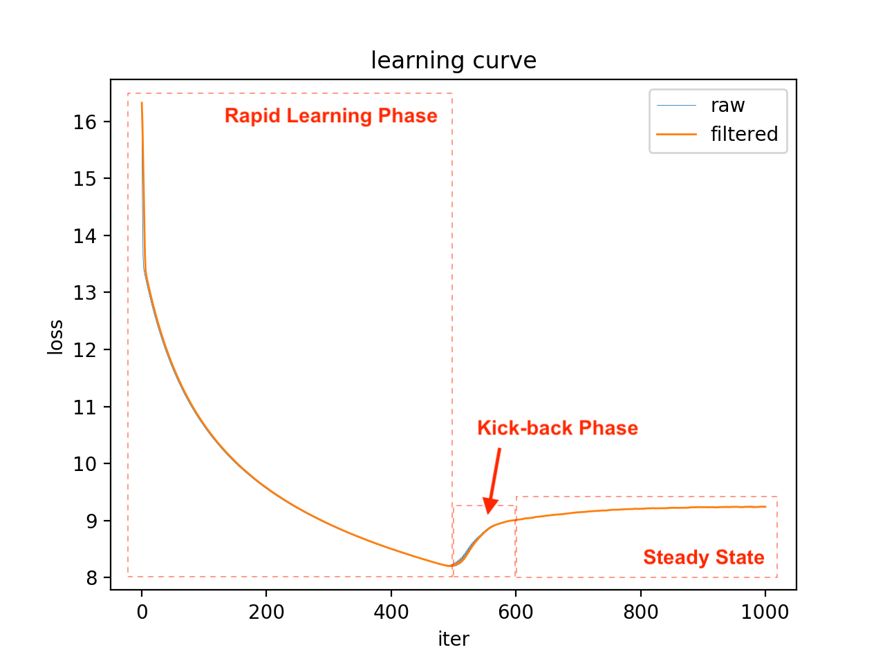

# Emergence of Synaesthesia in Neuronal Network Models

Synaesthesia is an unusual perceptual experience in which an inducer stimulus
triggers a percept in a different domain in addition to its own. This project
implements the model neuronal network model proposed by Shriki et al., 2016.

Reference:
```
Shriki, Oren, Yaniv Sadeh, and Jamie Ward. "The emergence of synaesthesia in a neuronal network model via changes in perceptual sensitivity and plasticity." PLoS computational biology 12.7 (2016): e1004959.
```


## Training Process

Below shows the learning curve of `1000` iterations of training with learning
rate `0.00035`, where the network is trained with `1000` random samples drawn
from Gaussian distributions at each dimension of different modality.




## Authorship

Below is the authorship information of this project.

  * __Name__:    Dicong "David" Qiu
  * __Email__:   david@davidqiu.com
  * __Website__: http://www.davidqiu.com/

Copyright (C) 2020, Dicong Qiu. All rights reserved.
